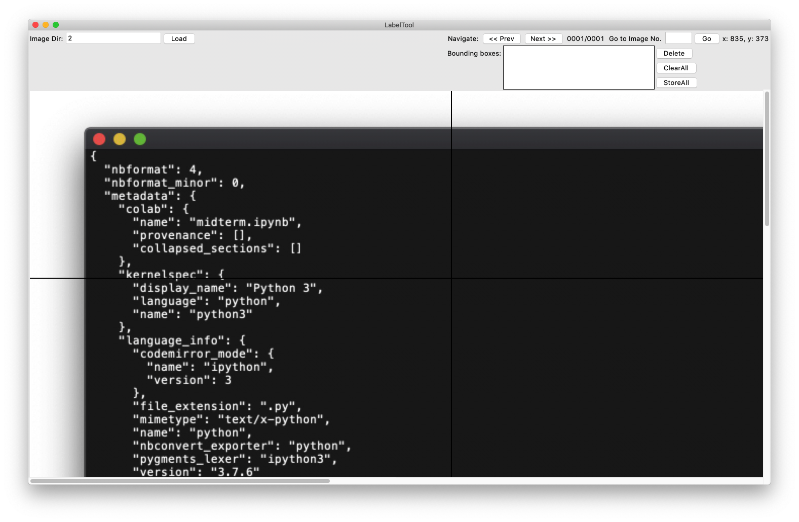

bbox_label_tool
===============

一个实现简单Bbox标注任务的程序 ([origion](https://github.com/puzzledqs/BBox-Label-Tool)) 使用Python Tkinter实现

**更新:**

- 2020.10.26 实现了对大尺寸图片的标注功能
  - 修改文件夹命名限制
  - 删除源项目Example功能

**使用界面:**

文件结构
-----------------
LabelTool  
|  
|--main.py   *# 主程序l*  
|  
|--Images/   *# 存放标注任务子文件夹*  
|  
|--Labels/   *# 标注结果*  

环境
----------
- python 3.8
- python PIL (Pillow)

运行
-------
$ python main.py

使用方法
-----
1. 该工具需要**将标注的图片放到/Images新建的相应标注任务子文件夹下**，通过输入相应标注任务文件夹名称，点击`Load`加载图片
2. 左击选座Bbox左上角坐标，移动鼠标再次左击即可选定BboxTo
  - 画Bbox时可以通过 `<Esc>`取消.
  -  `Delete`可以删掉刚才画的Bbox.
  -  `ClearAll`可以删掉该图片中所有Bbox.
  - `StoreAll`可以存储该图中所有Bbox到/Label文件夹下
3. 可以通过 `Next` `Prev` 来在标注任务子文件夹内选择图片
